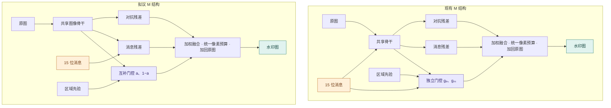
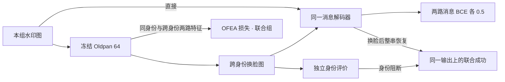

# 水印数据流对比

下图对比 N416 实验使用的 M 结构和拟议结构。每组使用自己的水印编码器和消息解码器。

```mermaid
flowchart TB
    accTitle: M 编码器修改前后
    accDescr: 现有结构把消息送入共享骨干和区域分配器。拟议结构把消息送入消息头，区域分配由图像和区域先验决定。
    subgraph current["现有 M 结构"]
        x["原图"] --> backbone["共享骨干"]
        m["15 位消息"] --> backbone
        m --> gates["独立门控 gₐ、gₘ"]
        p["区域先验"] --> gates
        backbone --> adv["对抗残差"]
        backbone --> msg["消息残差"]
        backbone --> gates
        adv --> fuse["加权融合 · 统一像素预算 · 加回原图"]
        msg --> fuse
        gates --> fuse
        fuse --> wm["水印图"]
    end
    subgraph proposed["拟议 M 结构"]
        xx["原图"] --> image["共享图像骨干"]
        mm["15 位消息"] --> message["消息残差"]
        pp["区域先验"] --> allocation["互补门控 a、1−a"]
        image --> adversary["对抗残差"]
        image --> message
        image --> allocation
        adversary --> merge["加权融合 · 统一像素预算 · 加回原图"]
        message --> merge
        allocation --> merge
        merge --> marked["水印图"]
    end
    classDef messageInput fill:#fff0d9,stroke:#b86a20,color:#713b14
    classDef gate fill:#e9e8ff,stroke:#6d59af,color:#312666
    classDef output fill:#e1f3ef,stroke:#287f70,color:#15463f
    class m,mm messageInput
    class gates,allocation gate
    class wm,marked output
```

```mermaid
flowchart LR
    accTitle: 各组的换脸与解码流程
    accDescr: 每组的同一张水印图沿直接和换脸两条路径进入同一个消息解码器。OFEA 使用 Oldpan 两路 Sigmoid 前输出。
    wm["本组水印图"] -->|直接| decoder["同一消息解码器"]
    wm --> oldpan["冻结 Oldpan 64"]
    oldpan --> swap["跨身份换脸图"]
    swap --> decoder
    decoder --> bce["两路消息 BCE 各 0.5"]
    oldpan -->|同身份与跨身份两路特征| ofea["OFEA 损失 · 联合组"]
    swap --> eval["独立身份评价"]
    decoder -->|换脸后整串恢复| joint["同一输出上的联合成功"]
    eval -->|身份阻断| joint
```
